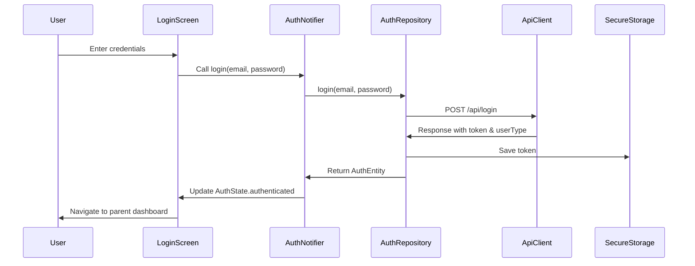
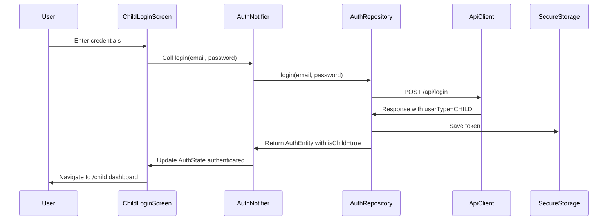
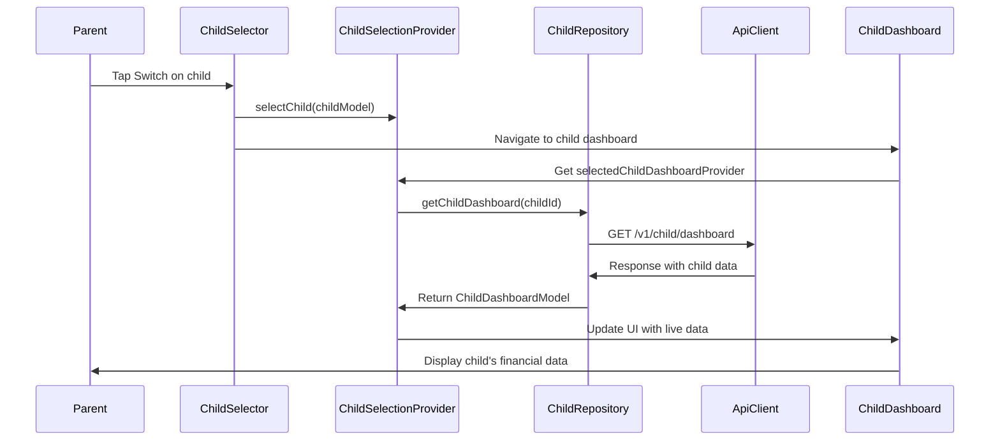
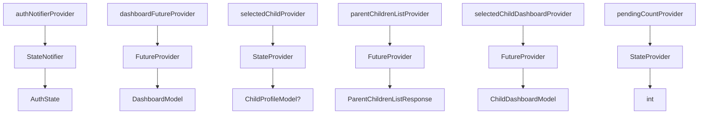
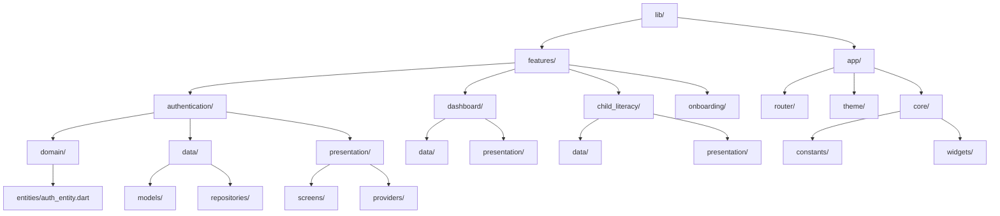
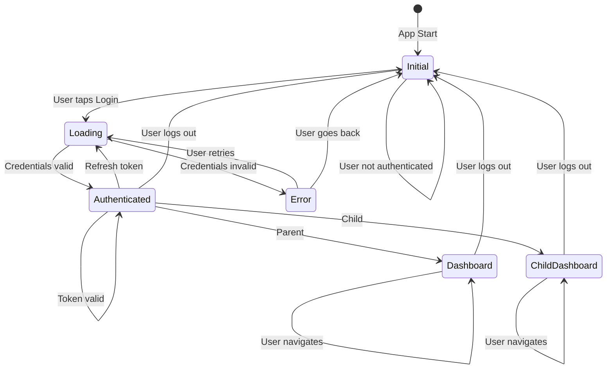

# FinAI Mobile App - Class Diagram

## Architecture Overview

```mermaid
classDiagram
    %% ==================== Authentication Layer ====================
    class AuthEntity {
        +int id
        +String email
        +String firstName
        +String lastName
        +String token
        +String refreshToken
        +UserType userType
        +bool profileComplete
        +int? childProfileId
        +bool get isParent
        +bool get isChild
        +String get fullName
    }

    class UserType {
        <<enum>>
        parent
        child
    }

    class LoginResponse {
        +String token
        +String refreshToken
        +UserData user
        +String userType
        +int? childProfileId
        +factory LoginResponse.fromJson(Map json)
        +Map toJson()
    }

    class UserData {
        +int id
        +String email
        +String firstName
        +String lastName
        +bool profileComplete
        +String? userType
        +factory UserData.fromJson(Map json)
        +Map toJson()
    }

    class AuthRepositoryImpl {
        +final SecureStorageService secureStorage
        +final ApiClient apiClient
        +Future~AuthEntity~ login(String email, String password)
        +Future~AuthEntity~ register(...)
        +Future~void~ logout()
        +Future~AuthEntity?~ getStoredUser()
        -UserType _mapUserType(String? userTypeStr)
    }

    class SecureStorageService {
        +Future~void~ saveToken(String token)
        +Future~String?~ getToken()
        +Future~void~ saveRefreshToken(String token)
        +Future~String?~ getRefreshToken()
        +Future~void~ clearAll()
    }

    %% ==================== State Management ====================
    class AuthState {
        <<sealed>>
        +initial()
        +loading()
        +authenticated(AuthEntity user)
        +error(String message)
    }

    class AuthNotifier {
        +StateNotifier~AuthState~
        +AuthEntity? _currentUser
        +Future~void~ login(String email, String password)
        +Future~void~ register(...)
        +Future~void~ logout()
        +Future~void~ loadStoredUser()
        -Future~void~ _setAuthState(AuthEntity user)
    }

    class DashboardProvider {
        +FutureProvider~DashboardModel~
        +fetchDashboardData()
    }

    class DashboardModel {
        +String userName
        +double totalIncome
        +double totalExpense
        +double netSavings
        +double totalDebt
        +double financialHealthScore
        +String riskLevel
        +String topRiskDriver
        +double monthlyBudgetAllocated
        +double monthlyBudgetSpent
        +double budgetUsagePercentage
        +List~ExpenseModel~ recentExpenses
        +List~IncomeModel~ recentIncomes
        +String latestRecommendation
        +String forecastSummary
    }

    %% ==================== Child Management ====================
    class ChildProfileModel {
        +int id
        +String name
        +int age
        +String profilePicture
        +double totalSavings
        +int savingsGoalsCount
        +String? lastActivityDate
        +factory ChildProfileModel.fromJson(Map json)
    }

    class ChildSelectionProvider {
        +StateProvider~ChildProfileModel?~ selectedChildProvider
        +FutureProvider~ParentChildrenListResponse~ parentChildrenListProvider
        +FutureProvider~ChildDashboardModel~ selectedChildDashboardProvider
    }

    class SelectedChildNotifier {
        +StateNotifier~ChildProfileModel?~
        +void selectChild(ChildProfileModel child)
        +void clearSelection()
        +int? get selectedChildId
    }

    class ChildDashboardModel {
        +int childId
        +String childName
        +int childAge
        +double totalSavings
        +List~SavingsGoalModel~ savingsGoals
        +List~AlertModel~ alerts
        +List~ChoreRewardModel~ chores
        +List~WishlistItemModel~ wishlist
    }

    class SavingsGoalModel {
        +int id
        +String title
        +String category
        +double targetAmount
        +double currentAmount
        +DateTime targetDate
        +String status
        +double get progress
        +factory SavingsGoalModel.fromJson(Map json)
    }

    class ParentChildrenListResponse {
        +List~ChildProfileModel~ children
        +int totalCount
        +factory ParentChildrenListResponse.fromJson(Map json)
    }

    %% ==================== Repositories ====================
    class ChildRepository {
        +final ApiClient apiClient
        +Future~ParentChildrenListResponse~ getParentChildren()
        +Future~ChildDashboardModel~ getChildDashboard(int childId)
        +Future~ChildProfileModel~ getChildProfile(int childId)
    }

    class DashboardRepository {
        +final ApiClient apiClient
        +Future~DashboardModel~ getDashboardData()
    }

    %% ==================== Screens/Widgets ====================
    class IntroScreen {
        +build(BuildContext context)
    }

    class UserTypeSelectionScreen {
        +build(BuildContext context)
        -_buildSelectionCard()
    }

    class LoginScreen {
        +_LoginScreenState
        -_formKey
        -_emailController
        -_passwordController
        -_handleLogin()
    }

    class ChildLoginScreen {
        +_ChildLoginScreenState
        -_formKey
        -_emailController
        -_passwordController
        -_handleLogin()
    }

    class MainDashboardScreen {
        +ConsumerWidget
        +build(BuildContext context, WidgetRef ref)
        -_DashboardHeader
        -_DashboardBody
    }

    class ChildProfileSelectorScreen {
        +ConsumerStatefulWidget
        +build(BuildContext context, WidgetRef ref)
        -_buildChildCard()
    }

    class ChildSavingsDashboardScreen {
        +ConsumerStatefulWidget
        +build(BuildContext context, WidgetRef ref)
        -_buildGoalCard()
        -_getIconForCategory()
    }

    %% ==================== API & HTTP ====================
    class ApiClient {
        +final String baseUrl
        +final Dio httpClient
        +Future~T~ get~T~(String endpoint)
        +Future~T~ post~T~(String endpoint, Map body)
        +Future~void~ setAuthToken(String token)
    }

    class Dio {
        +Future~Response~ get(String path)
        +Future~Response~ post(String path, Map data)
        +Future~Response~ put(String path, Map data)
        +Future~Response~ delete(String path)
    }

    %% ==================== Router ====================
    class AppRouter {
        +final List~RouteBase~ routes
        +GoRouter get router
    }

    class RouteNames {
        <<constants>>
        +String intro
        +String splash
        +String login
        +String childLogin
        +String userTypeSelection
        +String dashboard
        +String childProfileSelector
        +String childDashboard
    }

    %% ==================== Theme ====================
    class AppTheme {
        <<static>>
        +ThemeData get lightTheme
        +Color get primaryColor
        +Color get accentColor
    }

    class AppColors {
        <<static>>
        +Color primary
        +Color darkTeal
        +Color tealLight
        +Color white
        +Color success
        +Color error
        +Color warning
    }

    %% ==================== Constants ====================
    class AppConstants {
        <<static>>
        +String get baseUrl
        +Duration connectTimeout
        +Duration receiveTimeout
        +String tokenKey
        +String refreshTokenKey
    }

    %% ==================== Relationships ====================
    
    %% Authentication relationships
    AuthEntity --> UserType : uses
    LoginResponse --> UserData : contains
    AuthRepositoryImpl --> AuthEntity : returns
    AuthRepositoryImpl --> SecureStorageService : uses
    AuthRepositoryImpl --> ApiClient : uses
    AuthNotifier --> AuthEntity : manages
    AuthNotifier --> AuthRepositoryImpl : uses
    AuthState --> AuthEntity : contains

    %% Dashboard relationships
    DashboardProvider --> DashboardModel : returns
    DashboardModel --> ExpenseModel : contains
    DashboardModel --> IncomeModel : contains
    DashboardRepository --> DashboardModel : returns
    DashboardRepository --> ApiClient : uses

    %% Child management relationships
    ChildProfileModel --> SavingsGoalModel : contains
    ChildSelectionProvider --> ChildProfileModel : manages
    SelectedChildNotifier --> ChildProfileModel : manages
    ChildDashboardModel --> SavingsGoalModel : contains
    ChildDashboardModel --> AlertModel : contains
    ChildRepository --> ChildProfileModel : returns
    ChildRepository --> ChildDashboardModel : returns
    ChildRepository --> ApiClient : uses
    ParentChildrenListResponse --> ChildProfileModel : contains

    %% Screen relationships
    LoginScreen --> AuthNotifier : uses
    ChildLoginScreen --> AuthNotifier : uses
    MainDashboardScreen --> DashboardProvider : uses
    MainDashboardScreen --> AuthNotifier : uses
    ChildProfileSelectorScreen --> ChildSelectionProvider : uses
    ChildProfileSelectorScreen --> ChildRepository : uses
    ChildSavingsDashboardScreen --> ChildDashboardModel : uses
    ChildSavingsDashboardScreen --> ChildRepository : uses
    UserTypeSelectionScreen --> AppRouter : uses
    IntroScreen --> AppRouter : uses

    %% Router relationships
    AppRouter --> RouteNames : uses
    AppRouter --> LoginScreen : contains
    AppRouter --> ChildLoginScreen : contains
    AppRouter --> MainDashboardScreen : contains
    AppRouter --> ChildProfileSelectorScreen : contains
    AppRouter --> ChildSavingsDashboardScreen : contains

    %% Global relationships
    ApiClient --> AppConstants : uses
    AppRouter --> AppTheme : uses
    AppTheme --> AppColors : uses

```

---

## Data Flow Diagrams

### Parent Login Flow

### Child Login Flow

### Parent Views Child Dashboard Flow

---

## Provider Hierarchy

---

## File Structure

---

## Authentication State Machine

---

## Notes

- All classes follow SOLID principles
- Separation of concerns: Domain, Data, and Presentation layers
- Riverpod for state management and dependency injection
- GoRouter for navigation
- Secure storage for sensitive data (tokens)
- API client with error handling and retry logic

